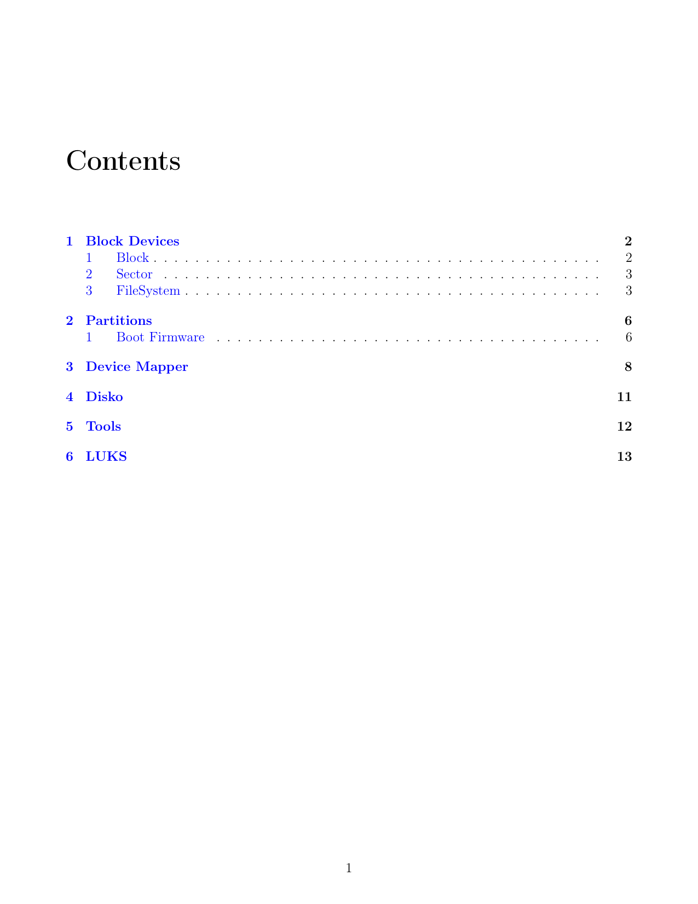

# Why This Exissts

I got tired of forgetting.

Not the commands---I could script those. Not the devices---I could list them.
What I kept losing was the shape of it all. The why. The mental model.

Every time I returned to LVM, filesystems, or partition tables, I felt like a stranger.
The stack was simple, but only if I kept it close. So I decided to write it
down. Not just as notes, but as a book for myself. One I could reread and trust.

This repo is that effort: to map the storage mind.
For me. For now. Maybe for you, too.

# README

[View the latest PDF](./linux-disks.pdf)
